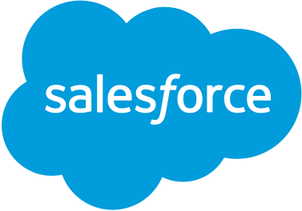

# SFDX  Lightning Web Component Drone Delivery Route Optimisation

## Description
You want to deliver your company's orders using drones? Great idea! However drones can't fly for very long so efficient flight paths are a *must*. Select the right customer contacts on the right then click the button to let Heroku calculate the optimal flight path for your delivery drone!

## Purpose
An example Lightning Web Component that uses Heroku to process Salesforce data and return a rich insight to the end user.

## Usage
1. After you spin up a Scratch org, activate geolocation data service for the org. In the setup menu under _Data -> Data Integration Rules -> Geocodes for Contact Mailing Address -> Activate_
2. Assign permission set to your user: `sfdx force:user:permset:assign -n DroneDeliveryUser`
3. Add some Contacts manually, or add more entries to the Contact.json file here and use
`sfdx force:data:tree:import -f Contact.json`
4. Check the custom field `Droneport__c` checkbox of a *single* Contact so it becomes the "warehouse" from where the drone flies out.
5. There's a hardcoded city filter for 'Sydney' at the moment, so you don't get too many results back from your contact list. If you're getting no contacts in the list change this.

## Heroku Pipelines
Consider using Heroku Pipelines if you setting up a CI/CD pipeline for your SFDX project. This repo contains a few files to enable Github pull requests to be automatically spun up as Scratch orgs which can then push a new unlocked package with the merged changes to a separate org (when the pull is merged). More info: https://github.com/heroku/salesforce-buildpack

---

## Tools

Salesforce Lightning Web Components Uses core Web Components standards and provides only what’s necessary to perform well in browsers supported by Salesforce. It’s built on code that runs natively in browsers, it's lightweight and delivers exceptional performance. Most of the code you write is standard JavaScript and HTML.
More information https://developer.salesforce.com/docs/component-library/documentation/lwc

Heroku is the fastest way to get from idea to url. We deployed a simple Python Flask server to respond to our API calls. The API receives a json payload with a list of coordinates and uses the Google OR Tools open source library to find the most efficient route.
More information www.heroku.com 

See this repo for the API server: https://github.com/feliperyan/optimal-flight-path-api

Google OR Tools is an open source software suite for optimization, tuned for tackling the world's toughest problems in vehicle routing, flows, integer and linear programming, and constraint programming.
More information https://developers.google.com/optimization/routing/tsp

